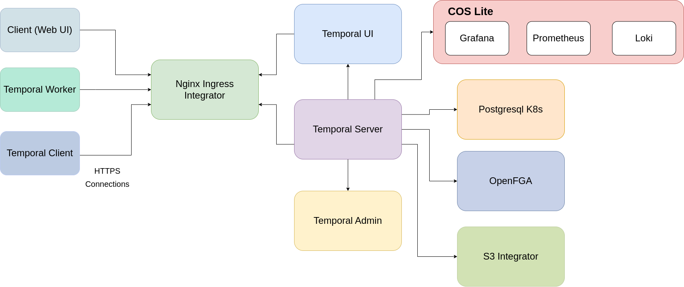

# Architecture

The Charmed Temporal ecosystem consists of a number of different charmed
operators related together. The diagram below shows a high-level illustration of
the different charms and their relations. The charmed components are as follows:

- **Temporal Server**: The
  [Temporal server](https://docs.temporal.io/clusters#temporal-server) is a
  group of four independently scalable services (frontend, history, matching and
  worker). It is responsible for state management and task synchronization among
  other functionalities.

- **Temporal Admin**: The Temporal Admin Tools are a set of command-line
  utilities used to configure and support the Temporal server.

- **Temporal UI**: The Temporal Web UI is a user interface used to interact with
  and monitor Temporal workflows and activities.

- **PostgreSQL K8s**: For Temporal
  [persistence](https://docs.temporal.io/clusters#persistence) and
  [visibility](https://docs.temporal.io/clusters#visibility), we use the
  [PostgreSQL K8s](https://charmhub.io/postgresql-k8s) charmed operator. The
  PostgreSQL K8s charm can be deployed and related to the Temporal server.

- **Nginx Ingress Integrator**: The Charmed Temporal K8s operator exposes its
  service ports using the
  [Nginx Ingress Integrator](https://charmhub.io/nginx-ingress-integrator)
  operator.

- **Temporal Worker**: The [Temporal Worker](https://docs.temporal.io/workers)
  is the entity which listens and polls on specific task queue, and executes
  code in response to the task.

