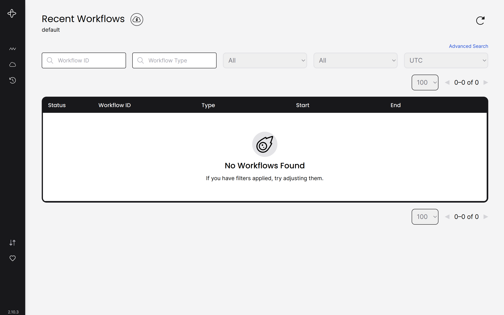

# Deploy Temporal Web UI

This is part of the
[Charmed Temporal Tutorial](https://discourse.charmhub.io/t/charmed-temporal-k8s-tutorial-introduction/11777).
Please refer to this page for more information and the overview of the content.

The Temporal Web UI is a user interface used to interact with and monitor
Temporal workflows and activities.

## Deploy and integrate

1. Deploy the Temporal UI.

```bash
juju deploy temporal-ui-k8s
```

2. Wait for the application to require the ui:temporal relation relation.

```
Unit                Workload  Agent  Address     Ports  Message
temporal-ui-k8s/0*  blocked   idle   10.1.0.111         ui:temporal relation: not available
```

3. Integrate with Temporal Server

```
juju integrate temporal-k8s:ui temporal-ui-k8s:ui
```

4. Wait for both charms to be active and idle

## Access the UI on a web browser

Depending on the local configuration, the Temporal Web UI can be accessesed
uisng:

* The unit IP directly

```
TEMPORAL_UI_IP=$(juju show-unit temporal-ui-k8s/0 | yq '.temporal-ui-k8s/0.address')

# In the browser
http://{TEMPORAL_UI_IP}:8080
```

* The ingress IP or DNS name - This requires extra configuration, please refer to [Configure Ingress with Nginx Ingress Integrator](https://discourse.charmhub.io/t/charmed-temporal-k8s-tutorial-deploy-nginx-ingress-integrator/11783)



> **See next:
> [Deploy Nginx Ingress Integrator](https://discourse.charmhub.io/t/charmed-temporal-k8s-tutorial-deploy-nginx-ingress-integrator/11783)**
